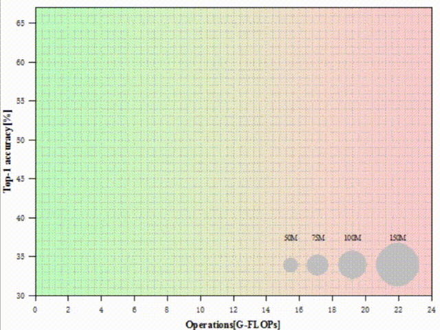

# Analysis of High Performance Heterogeneous Computing Performance Based on Cloud Platform and Edge Platform
## Dependencies:
* Python 2.7
* [PyTorch](https://pytorch.org/) 1.9.0
* Torchvision
* [Jetpack](https://developer.nvidia.com/jetpack-sdk-44-archive)-4.4
* TensorRT 7.1.3
* [Google Colab](https://www.google.com/intl/zh-CN_ALL/drive/)
* [SPSS](https://www.ibm.com/analytics/spss-statistics-software)
* [OriginLab](https://www.originlab.com/)

## Introduce
We selected nearly 40 commonly used deep neural network models, and analyzed their cross-platform and cross-reasoning frameworks in depth. By analyzing and comparing the obtained data, the performance of each model can be well grasped, and at the same time, some indexes of untested models can be predicted, which has guiding significance for future experiments and work. Some results are given below, and the specific results are shown in the paper.

### Accuracy and Model Complexity
We tested the relationship between the Top-1 accuracy of each model and the complexity of the model, drew the following bubble chart, and gave the drawing process.(The drawing process of all subsequent bubble charts is similar.)

### Accuracy and Model Efficiency
Based on the obtained data, we drew the bubble chart of the relationship between the Top-1 accuracy and the precision density of each model.

### Reasoning Time and Analysis Comparison
We get different Batch Size and reasoning time of different network models on Google Colab platform. See table below. See the paper for Reasoning time on Jetson Nano.

### Accuracy and Reasoning Time
We draw the bubble chart of the relationship between the Top-1 accuracy and FPS of each network model in Google Colab platform. See the paper for the bubble chart of the relationship between Top-1 accuracy and FPS in Jetson Nano.

### Memory Usage and Model Complexity
We draw a bubble chart of the relationship between GPU memory consumption and parameter content of different DNNs in Google Colab under Batch Size of 1.

